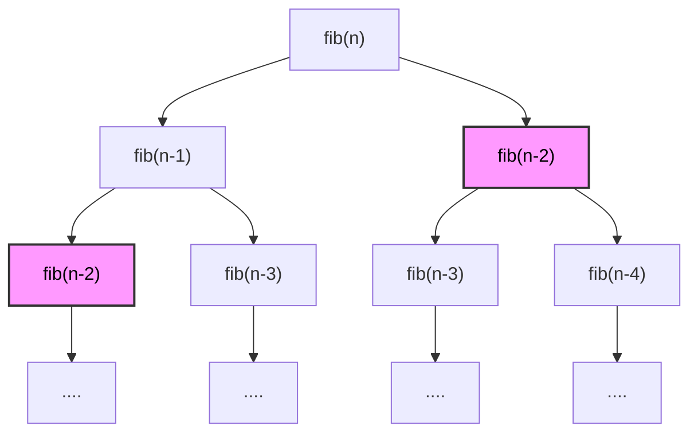
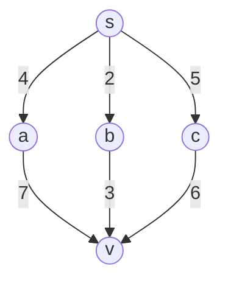
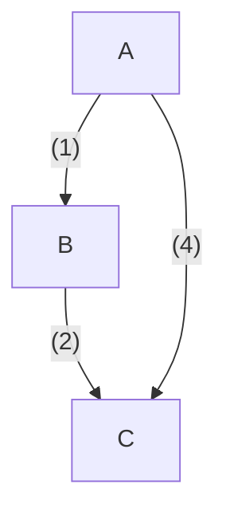

# Understanding Dynamic Programming 

Dynamic Programming is a design technique involves dividing a problem into smaller subproblems to optimize performance. 

There are several variations to applying Dynamic Programming to solve problems in this category. 
The best way is to understand these variations is by understanding the following examples.
These examples are demonstrated in OCW 6.006 Fall 20011 by Erik Demaine from lectures 19 through ??.

Video Link:
Notes Link: 


The main idea behind solving problems using Dynamic Programming includes: 
1. Careful Brute Force
2. Subproblems + Reuse

We'll learn through examples and recognize the different facets of using Dynamic Programming.

## Example 1: Fibonacci Numbers

### Approach 1: Top-down (Memoization)

Let's understanding the crux of this design technique through a very popular example: 
[[Fibonacci Numbers]]

Fibonacci numbers can be represented as 
$$F_1 = F_2 = 1; \qquad F_n = F_{n-1} + F_{n-2}$$

**Goal:** Compute $F_n$

**Solution:**

The recursive definition of finding the n<sup>th</sup> Fibonacci Number is: 

```python
fib(n): 
	if n >= 2:
		fib(n) return 1
	else
		return fib(n - 1) + fib(n - 2)
```

Let's analyze its time complexity.

**Complexity:**

$$ T(n) = T(n -1) + T(n - 2) + O(1) \newline >= 2(n -2) + 1 + O(1) >= 2^{n/2}$$
The algorithm takes exponential time as the value of $n$ increases.
It's a bad algorithm.

Let's observe how we can optimize by reducing repetitive operations.





#observations👁️ 

Notice how we are recalculating `fib(n-2)`. 
We can compute `fib(n-2)` once and store it. That's exactly how we optimize our algorithm.

In order to store these values let's use an integer array.

Whenever we encounter a new value, we store it in this array.
Whenever we encounter this value again, we use this value instead of calculating again. 

#definition 
This concept of using memory to reuse the values that are already computed once is called as [[Memoization]].

Let's modify our algorithm.

`memo` represents the integer array.
`f` is a variable which stores the intermediate values of the Fibonacci Numbers to reach the `n`<sup>th</sup>

```python
memo = {}; 
fib(n): 
	if n in memo: 
		return memo[n];
	else: 
		if (n <= 2):
			f = 1
		else:
			f = fib(n - 1) + fib(n - 2)
		memo[n] = f
	return f;
```

Let's do a dry run for finding `fib(6)` i.e. when `n` is `6`.

```mermaid
graph TD

  %%─── Style definitions ──────────────────────────────────────────
  classDef calculated  fill:#add8e6,stroke:#00008b,stroke-width:1.5px,color:#000;
  classDef memoized    fill:#90ee90,stroke:#006400,stroke-width:1.5px,color:#000;
  classDef basecase    fill:#fffacd,stroke:#bdb76b,stroke-width:1.5px,color:#000;

  %%─── Nodes and edges ──────────────────────────────────────────

  F6["fib(6)"]
  F6 --> F5["fib(5)"]
  F6 --> F4_m["fib(4) (memo)"]

  F5 --> F4_c["fib(4) (computed)"]
  F5 --> F3_m["fib(3) (memo)"]

  F4_c --> F3_c["fib(3) (computed)"]
  F3_c --> F2_b1["fib(2)"]
  F3_c --> F1_b1["fib(1)"]
  F4_c --> F2_b2["fib(2)"]

  %%─── Apply styles ─────────────────────────────────────────────
  class F6,F5,F4_c,F3_c calculated;
  class F4_m,F3_m memoized;
  class F1_b1,F2_b1,F2_b2 basecase;

```




- **Blue** nodes represents the computed values that are stored in `memo` after getting computed once. 
- **Green** nodes represents the memoized values, we got it from `memo` and immediately returned.
- **Yellow nodes** represents the base values which are equal to `1`.

As we can observe that the first function that our algorithm computes is `fib(3)`  calculated  using `fib(n - 1) + fib(n - 2)` with the base values `fib(2)` + `fib(1)` i.e. `1` + `1` = `2`.

As we can observe, the first non-trivial computation our algorithm performs is for `fib(3)`, which is calculated using recurrence relation: 

```python
fib(3) = fib(2) + fib(1) = 1 + 1 = 2
```

Once we compute the value for `fib(3)`, we store it in the `memo` array. 
The next time the value of `fib(3)` is required, the algorithm checks whether it already exists using the line: 

```python
if n in memo: 
```
 
If a valid entry exists at index `3` in `memo`, the function returns that value directly, skipping the recursive calls. 

Since `fib(3)` was previously stored in `memo[3]`, the function returns this cached value, improving efficiency by avoiding redundant computations.
#### Complexity Analysis: 

**Time Complexity:** 

To calculate the `n`<sup>th</sup> Fibonacci number using memoization, we observe the structure of the recursive tree.

Each call to `fib(k)` can make at most two recursive calls:
1. `fib(k - 1)`
2. `fib(k - 2)`

However, due to memoization, each unique value of `fib(k)` is computed **only once**. Once computed, the result is stored in `memo`, and any subsequent requests for `fib(k)` are fetched in **constant time**, i.e., $O(1)$.

So, for the first run (when memo is empty), we recursively compute:

```
fib(n), fib(n - 1), fib(n - 2), ..., fib(2), fib(1)
```

There are `n` distinct Fibonacci numbers from `fib(1)` to `fib(n)`, so:
- Total number of *non-memoized* recursive calls = **n**
- Each takes constant time: 2 memo lookups + 1 addition + storing in memo ⇒ $O(1)$ per call

Thus, the total time complexity is:
$O(n) * O(1) = O(n)$


The **memoized calls** (i.e., future re-uses) take only $O(1)$ time each and don't affect the overall linear growth.

Therefore, the final time complexity is **O(n)** — the algorithm runs in **linear time**.

**Space Complexity:** 

Since, our `memo` data structure stores at most `n` unique Fibonacci values from `fib(1)` to `fib(n)`, the space complexity is $O(n)$.
Therefore, we can say that our algorithm runs in linear space. 

### Approach 2: Bottom-up (Tabulation)

Let's take look at the code: 

```java
fib = []; 
fib[0] = 0
fib[1] = 1

for i in 2 -> n: 
	fib[i] = fib[i - 1] + fib[i - 2]

return fib[n]
```

#observations👁️ 

1. We don't use recursion, we use a `for` loop to get all the values one-by-one from 1 to n. 
2. It's exactly the same computation as memoized DP in our previous approach. 
3. We replace recursion with a loop to compute each value iteratively.
4. In the previous algorithm, we use recursive calls from `n` down to `1`.
5. In this approach, we compute iteratively from `1` to `n`.
6. Notice how we use indices of the array to get the values for calculating the intermediate values, instead of recursive calls. 

Let's do a dry run where `n` is `6`:

| 0   | 0      | The default value for fib[0] as we initialize fib[] for the first time |
| --- | ------ | ---------------------------------------------------------------------- |
| 1   | 1      | The base value for fib[1]                                              |
| 2   | 1      | The base value for fib[2]                                              |

| i   | fib[i - 1] + fib[i - 2] | fib[i] | fib[]                 |
| --- | ----------------------- | ------ | --------------------- |
| 3   | fib[2] + fib[1] = 1 + 1 | 2      | [0, 1, 1, 2]          |
| 4   | fib[3] + fib[2] = 2 + 1 | 3      | [0, 1, 1, 2, 3]       |
| 5   | fib[4] + fib[3] = 3 + 2 | 5      | [0, 1, 1, 2, 3, 5]    |
| 6   | fib[5] + fib[4] = 5 + 3 | 8      | [0, 1, 1, 2, 3, 5, 8] |

Therefore, `fib(6)` is `8`.

#definition 
This approach of storing values in a bottom-up manner is known as [[Tabulation]].


#insight💡 
This approach generally has better readability and is easier to analyze.
It saves some space since it avoids recursion and instead uses an array.
However, since we use a `for` loop, we do end up performing `n` operations. 

#### Complexity Analysis: 

**Time Complexity:**
Since, we use a `for` loop to run `n` operations, the time complexity is $O(n)$.

**Space Complexity:**
Since, we use an array `fib[]` of size `n + 1` to store the Fibonacci values from `0` to `n`.
The space complexity is $O(n)$.

#insight💡 
We don't actually need to store all values from `0` to `n` — just the last two.
This lets us reduce space from $O(n)$ to $O(1)$. More on that in the next approach. 


### Approach 3: Space Optimization on Approach 2

We don't need the `fib[]` only the last two values.

```python
if (n == 0) return 0 
if (n == 1) return 1 

int prev2 = 0
int prev1 = 1
int curr = 0

for i in range 2 -> n: 
	curr = prev1 + prev2 
	prev2 = prev1
	prev1 = curr

return curr
```

**Time Complexity:** $O(n)$

**Space Complexity:** $O(1)$


## Example 2: Shortest Paths

### Problem: DelBot

Imagine you're a delivery robot starting at a warehouse `s`, and you need to deliver a package at location `v`. You can travel through intermediate stops: `a`, `b` or `c`, each offering a different route and cost. Find the cheapest route from `s` to `v`.

*Each path has a delivery cost (distance, fuel, time, however you want to think about it)*.
The goal is finding the best path. 


---
### Solution: 

Let's understand the problem statement technically. 

We have a weighted directed graph where `s` is the source, and `v` is the target node, where we have to find a path from `s` to `v`, such that the total weight of this path is minimum.


We need the minimum weight as well as the shortest distance. 
This implies we choose a path where both weights and the distances are minimum. 

> **Recursive formulation:** 

$δ(s, v) = min\{w(u, v) + δ(s, u)|(u, v) ∈ E \}$ 

The shortest distance from the source node `s` to node `v` is the minimum over all nodes `u` that have an edge into `v`, of: 

(Shortest distance from `s` to `u`) + (weight of edge from `u` to `v`)


> Breaking it down : 

| Symbol       | Meaning                                                 |
| ------------ | ------------------------------------------------------- |
| $δ(s, v)$    | Shortest path distance from source `s` to node `v`      |
| $w(u, v)$    | Weight of edge from node `u` to node `v`                |
| $δ(s, u)$    | Shortest path from source `s` to note `u`               |
| $(u, v) ∈ E$ | All edges in the graph that end at node `v`             |
| $min\{...\}$ | Try all possible `u`'s and pick the smallest total cost |


### Approach 

To efficiently compute the shortest paths using this recursive relationship, we can employ a dynamic programming strategy. 
This involves breaking down the problem into smaller subproblems and building up the solution.

Erik Demaine gave the 5 easy steps to solve any Dynamic Programming problem.
- Let's define $δ_k(s, v)$ as the shortest distance from $s$ to $v$ using at most $k$ edges. 
- Base Case $δ_0(s, s) = 0$ and $δ_0(s, v) = ∞$ for all $v ≠ s$. 
- Recurrence Relation: 

$$
\delta_k(s, v) = \min\left( \delta_{k-1}(s, v), \min_{(u, v) \in E} \left[ \delta_{k-1}(s, u) + w(u, v) \right] \right)
$$
This recurrence considers two possibilities for reaching $v$ with at most $k$ edges: 
1. The shortest path to $v$ with at most $k-1$ edges.
2. A path that reaches $v$ from some predecessor $u$ with exactly $k$ edges.

By iteratively computing $\delta_k(s, v)$ for increasing values of $k$, we can find the shortest paths from $s$ to all other nodes.


Let's consider a simple directed graph: 




**Vertices:** A, B, C
**Edges and Weights:**
- A -> B: 1
- B -> C: 2
- A -> C: 4
**Objective:** Find the shortest path from A to C.

**Approach:**
1. Initialize distances: 
	- $\delta_0(A, A) = 0$
	- $\delta_0(A, B) = ∞$
	- $\delta_0(A,C) = ∞$
		*We initialize ∞ because we haven't visited Edges A -> B*
2. For $k = 1$:
	- $\delta_1(A, B) = min(\delta_0(A, B), \delta_0(A, A) + w(A, B)) = min(∞, 0+1) = 1$
	- $\delta_1(A, C) = min(\delta_0(A, C), \delta_0(A, A) + w(A, C)) = min(∞, 0 + 4) = 4$

3. For $k = 2$: 
	- $\delta_2(A, C) = min(\delta_1(A, C), \delta_1(A, B) + w(B, C)) = min(4, 1 + 2) = 3$

Thus, the shortest path from A to C is A -> B -> C with a total weight of 3. 


# Patterns To Master For Solving Problems

1. [[0/1 Knapsack]]
2. [[Unbounded Knapsack]]
3. [[Subset Sum]]
4. [[LIS / LCS]]
5. [[Bitmask DP]]

## 5 easy steps to solve DP Problems

1. Define Subproblems
2. Guess : Part of Solution
3. Relate Subproblem 