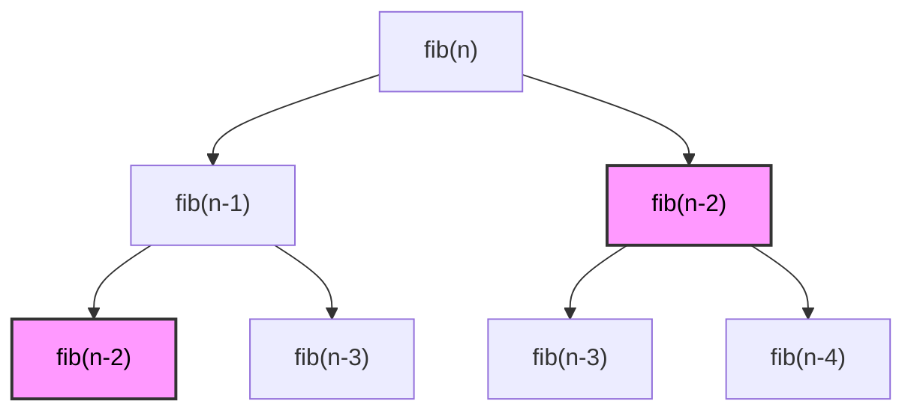

# Understanding Dynamic Programming 

Dynamic Programming is a design technique involves dividing a problem into smaller subproblems to optimize performance. 

There are several variations to applying Dynamic Programming to solve problems in this category. 
The best way is to understand these variations is by understanding the following examples.
These examples are demonstrated in OCW 6.006 Fall 20011 by Erik Demaine from lectures 19 through ??.

Link:


## Starting out

Let's understanding the crux of this design technique through a very popular example: 
[[Fibonacci Numbers]]

Fibonacci numbers can be represented as 
$$F_1 = F_2 = 1; \qquad F_n = F_{n-1} + F_{n-2}$$

**Goal:** Compute $F_n$

**Solution:**

The recursive definition of finding the n<sup>th</sup> Fibonacci Number is: 

```python
fib(n): 
	if n >= 2:
		fib(n) return 1
	else
		return fib(n - 1) + fib(n - 2)
```

Let's analyze its time complexity.

**Complexity:**

$$ T(n) = T(n -1) + T(n - 2) + O(1) \newline >= 2(n -2) + 1 + O(1) >= 2^{n/2}$$
The algorithm takes exponential time as the value of $n$ increases.
It's a bad algorithm.

Let's observe how we can optimize by reducing repetitive operations.





#observations👁️ 

Notice how we are recalculating `fib(n-2)`. 
We can compute `fib(n-2)` once and store it. That's exactly how we optimize our algorithm.


Let's use a [[HashMap]].

Whenever we encounter a new value, we store it in this HashMap.
Whenever we encounter this value again, we use instead of calculating again. 

This concept of using memory to reuse the value is called as [[Memoization]].


# Patterns To Master For Solving Problems

1. [[0/1 Knapsack]]
2. [[Unbounded Knapsack]]
3. [[Subset Sum]]
4. [[LIS / LCS]]
5. [[Bitmask DP]]

## 5 easy steps to solve DP Problems

1. Define Subproblems
2. Guess : Part of Solution
3. Relate Subproblem 