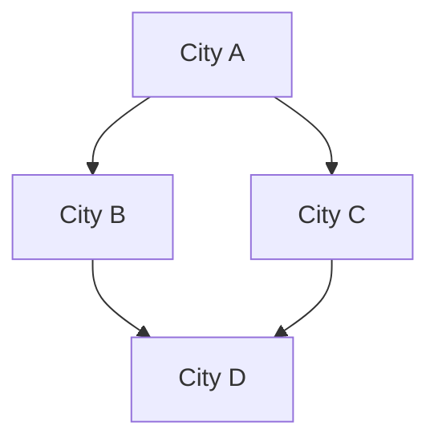
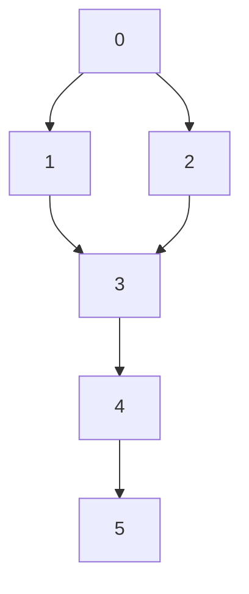
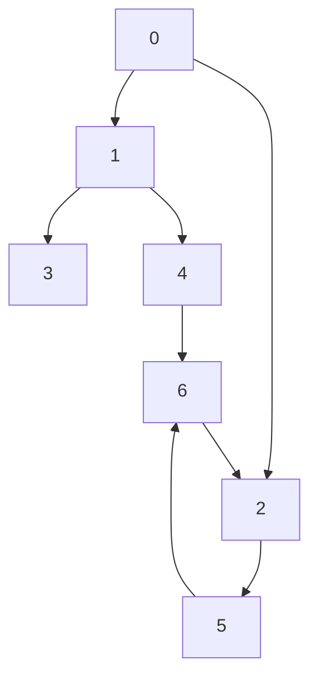
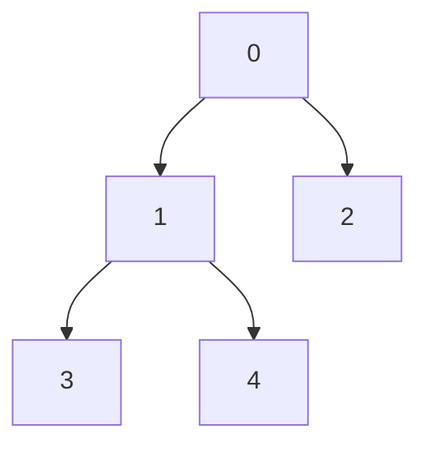
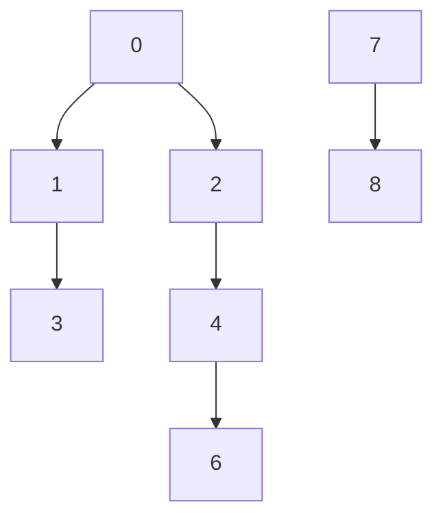

Think of graph like a treasure map:
1. Places (Dots) = Vertices or Nodes
2. Path (Lines) = Edges 

There are: 
1. Undirected graphs (road goes both ways)
2. Directed graphs (digraphs) (one-way road)
3. Weighted graphs (roads have tolls or distances)

Example: 



## BFS (Breadth-First Search)

Imagine you're in a castle and want to find the closest treasure: 

BFS says: 

Let's search all rooms on the same floor before going upstairs. 


How it works: 

1. Start at node. 
2. Visit all its neighbors.
3. Then visit neighbors of neighbors.
4. Use a queue. 


Ideal for 
1. Shortest path in unweighted graphs. 
2. Level-by-level exploration.


## DFS (Depth-First Search)

Now you're in a cave and want to go as deep as you can before before turning back. 
DFS says: 
"Let's keep going in one direction until we hit a dead-end, the backtrack."

1. Start at node. 
2. Visit a neighbor and go deep. 
3. If stuck, backtrack to the last split.
4. Use a stack. (Either manually or via recursion)

Ideal for: 
- Finding connected components 
- Maze solving 
- Topological sorting 

Let's understand BFS and DFS traversal. 
# Round 1 

Let's find how BFS and DFS traverses the graph.



## BFS Traversal

We use [[Queue]] to keep track of the visited nodes. 
Our traversal should look something like this: 

```
0 -> [1, 2]
1 -> [3]
2 -> [3]
3 -> [4]
4 -> [5]

```

So our order of BFS is: 
0, 1, 2, 3, 4, 5

Because that's how we end up visiting the nodes.


## DFS Traversal

We use [[Stack]] 

The order is: 

0, 1, 3, 4, 5, 2 

or 

0, 2, 3, 4, 5, 1


## Round 2 

Let's take a look at another example: 



## BFS Traversal

Adjacency List: 

```
0 --> [1, 2]
1 --> [3, 4]
3 --> []
4 --> [6]
6 --> [2]
2 --> [5]
5 --> [6]
```

BFS 0, 1, 3, 4, 6, 2, 5


## DFS Traversal

DFS 0, 1, 3, 4, 6, 2, 5


# Coding Graphs
## Graph Structure 

Let's understand this how we can define a Graph Structure using Java: 

```java
Map<Integer, List<Integer>> adj; 
```

This is our adjacency list: 

Let's say our graph looks like the following: 




This is how the adjacency list will store our graph.

```
0 -> [1, 2]
1 -> [3, 4]
```




DFS 0, 1, 3, 2, 4, 6, 

