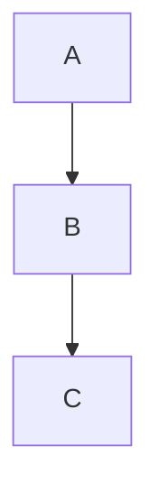
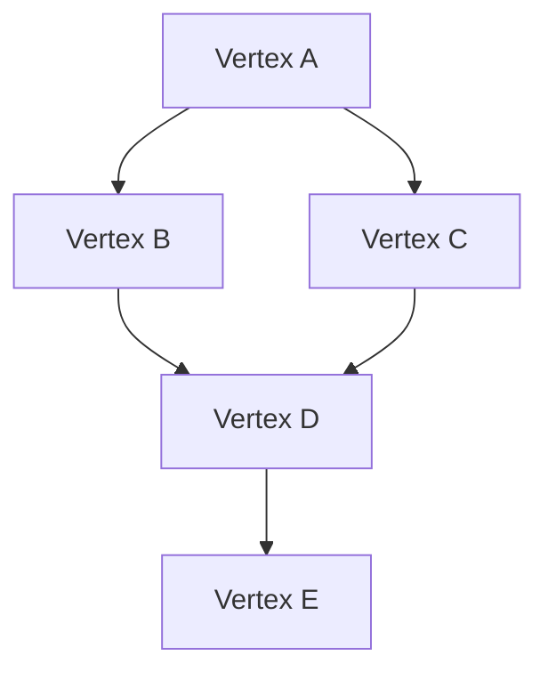
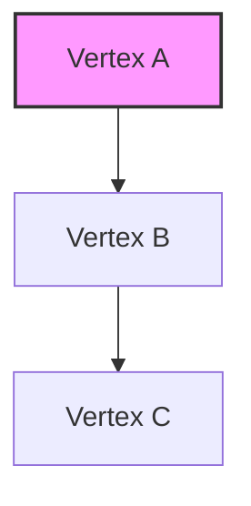

# graph

```mermaid
graph TD

	A --> B --> C
```

```mermaid

graph TD 
	A[Vertex A] --> B[Vertex B]
	A --> C[Vertex C]
	B --> D[Vertex D]
	C --> D
	D --> E[Vertex E]
```

```mermaid
%% In supported markdown renderers
graph TD
	classDef highlighted fill:#f9f,stroke:#333,stroke-width:2px;
	A[Vertex A]:::highlighted --> B[Vertex B]
	B --> C[Vertex C]
```

