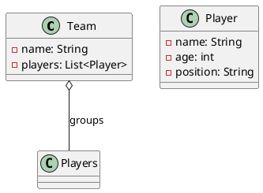

# 2. Aggregation 

> Definition: 
> Aggregation is a special type of association where one object (the whole) is made up of multiple objects (the parts), yet each part can exist independently.

#analogy #example
Think of a library and its books. 
A library collects many books, but if this library shuts down, the books can still exist on their own (perhaps joining other library or a personal collection). 

Think of a team and its players.
A team is a group of players, but each player can exist independently outside of that team.

#uml #plantUML #classDiagram 
### Representation 

**Diagram:** 
![[aggregation-example.png]]

**Code:**

