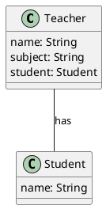

# 1. Association 

> Definition: 
> Association is a relationship between two objects where one object uses or interacts with another. They are connected but can exist independently

#analogy 
Think of a teacher and a student. 
A teacher can teach many students, and a student can learn from many teachers. They're associated, but one doesn't rely on other to exist.

#uml #plantUML #classDiagram 
## Representation

Arrow Notation: 

**Diagram:**
![[association-example.png]]

**Code:** 
