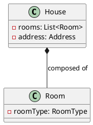

# 3. Composition 

> Definition: 
> Composition is a form of aggregation where the parts are inseparable from the whole. If the whole is destroyed, the parts are too. 

#analogy 
Think of a house and its rooms.
The rooms are integral parts of a house. If the house is demolished, the rooms seize to exist as standalone entities.

### Representation

**Diagram:**

**Code:** 

