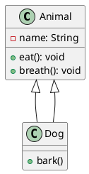

# 5. Generalization

> Definition: 
> Generalization represents an inheritance relationship, where a subclass (child class) inherits attributes and behaviors from from a superclass (parent class). It captures the "is-a" relationship. 

#analogy 
Now, think of generalization as a family resemblance. Picture a broad category called Animal, which outlines common traits like eating and breathing. 

When you look at a specific animal, say a dog, you see that it inherits these general traits from the Animal category, but also adds its own unique behavior, like barking. Here, the dog is a specialized version of Animal, and that inheritance of common features is what we call generalization.

#uml #plantUML #classDiagram 
### Representation

**Diagram:**

![[generalization-example.png]]

**Code:**

