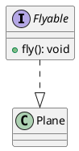

# 4. Realization 

> Definition: 
> Realization is the relationship in UML where a class commits to implementing the behavior defined by an interface. In essence, it shows that the class fulfils the contract specified by an interface.

#analogy 
Imagine you have a category of Flyable vehicles—a kind of promise that any vehicle in this category must be able to fly. 
Now, consider a plane. The plane “realizes” this promise by taking on the Flyable contract and implementing the flying behavior exactly as a plane should. In other words, the plane signs on to the Flyable agreement and delivers its own version of flying, fulfilling that contract.

#uml #plantUML #classDiagram 
### Representation

**Diagram:**

![[realization-example.png]]

**Code:**

