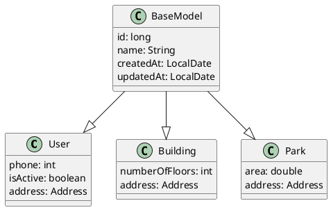

# `@EqualsAndHashCode`

## What is `@EqualsAndHashCode`? 
`@EqualsAndHashCode` is a Lombok annotation used to automatically generate `equals()` and `hashCode()` methods based on the fields in the class. 

By default, Lombok includes all non-static, non-transient fields when generating these methods - unless specified otherwise. 

[[Static Fields]] and [[Transient Fields]] are excluded by default — unless explicitly included.

		
## Why it matters? 

These generated methods define how objects are compared using `equals()` and how they're stored in hash based collections using `hashCode()`.


This is critical in cases where object equality isn't just reference-based (`==`) but value-based.

For instance: 

```java
User u1 = new User("Swar", "swar@example.com");
User u2 = new User("Swar", "swar@example.com");

// Without equals() and hashCode() overridden 
System.out.println(u1.equals(u2)); // false

// With @EqualsHashCode
System.out.println(u1.equals(u1)); // true
```


In short, *"No override, no object love. ❤️"*

### Customizing it

You can customize which fields are included using: 

```java
// including single field
@EqualsAndHashCode(of = "email")
```

```java
// including multiple fields
@EqualsAndHashCode(of  = {"username", "email"})
```

This means only the `email` and `username` will be used in `equals()` and `hashCode()`.

You can also customize by excluding using:

```java
// excluding a single field
@EqualsAndHashCode(exclude = "password")
```

```java
// excluding multilple fields
@EqualsAndHashCode(exclude = {"passoword", "age"})
```


## Common Pitfalls 

- **Including mutable [[State Fields]]**  
    Fields that can change (like `isActive`, `balance`, `token`) shouldn't be used for equality.  

	➤ If their value changes after insertion into a [[HashSet]] or as a key in [[HashMap]], the object becomes _unreachable_. 🙈
    
- **Ignoring important [[Identity Fields]]**  
    Excluding key identifiers like `id` or `email` may lead to unexpected equality results — objects that should match might not.
    
- **Breaking the contract**  
    Objects that are `.equals()` **must** have the same `hashCode()`.  
    ➤ If you override one and not the other, expect erratic behavior in hash-based collections.


## When to use it...
you want consistent, meaningful equality and hashing behavior for your objects without writing boilerplate code.

## Don't use when...
you need fine grained control or are already overriding `equals()` and `hashCode()` manually.

---
# `@EqualsAndHashCode(callSuper = true)` 

## What is `@EqualsAndHashCode(callSuper = true)`? 

`@EqualsAndHashCode(callSuper = true)` tells Lombok to include fields from the superclass when generating `equals()`. and `hashCode()` methods for the subclass. 

This ensures that the objects of this can be uniquely identified when compared.

## Why it matters? 

If you don't include `(callSuper = true)` in a certain class, only fields declared in this class are considered for `equals()` and `hashCode()`. Fields from the superclass are ignored.

Class fields like IDs, usernames, emails, phonenumbers are usually tied to identifying an object uniquely.//
Fields like `id`, `username`, `email`, and `phoneNumber` are typically used to identify an object —these are known as [[Identity Fields]].

Usually, the identity of an object is tied to its ID field. For e.g. `id` in `User` class, etc.

In case of multiple entities, the common fields from these entities are extracted to an abstract class like `BaseModel` as shown below: 



Here, `BaseModel` contains fields that are likely identity-defining, which multiple domain entities (like `User`, `Building`, `Park`) inherit from.

Including `(callSuper = true` enables [[Identity Fields]] of the child class to relate itself with its superclass for identifying and equality operations.

[[Hash-based Collections]] like [[HashMap]], [[HashSet]], etc., make use of the hash code of these [[Identity Fields]] to store objects.


## What could go wrong? 

Imagine, if we use [[State Fields]] as keys in these [[Hash-based Collections]]. 
If this State Field changes, the hash code of this field will naturally change. 
If such an object is stored in a hash-based collection and then the state field changes, the object's hash code changes too. This makes it untraceable in the collection, leading to duplicate entries or unexpected behavior.

## When to use it? 

### Use when... 
you know you want the entity to uniquely identify objects based on their superclass-defined identity fields during equality operations using `equals()`.
### Don't use when... 
you're unsure whether your class fields clearly fall into [[Identity Fields]] or [[State Fields]] — though in practice, this is rarely the case.


